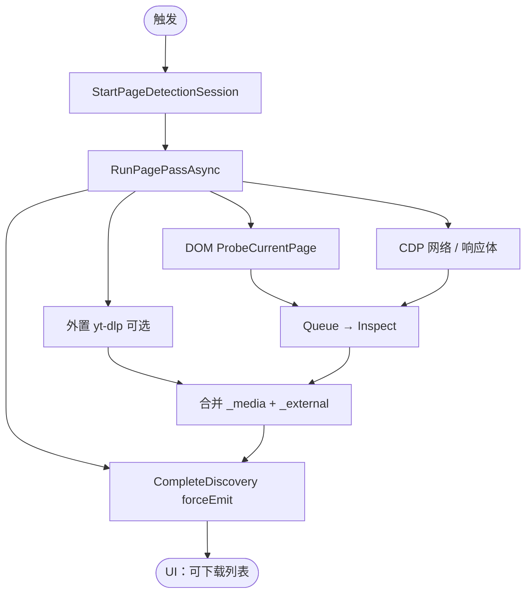
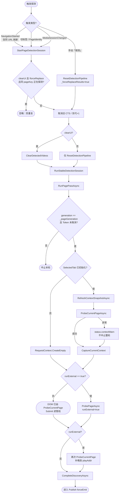
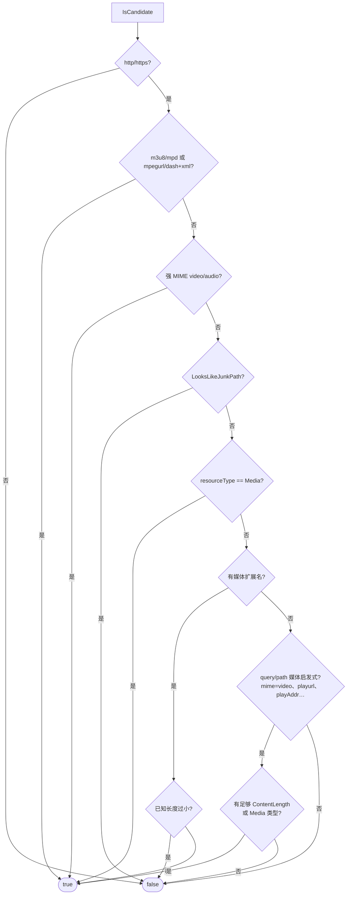
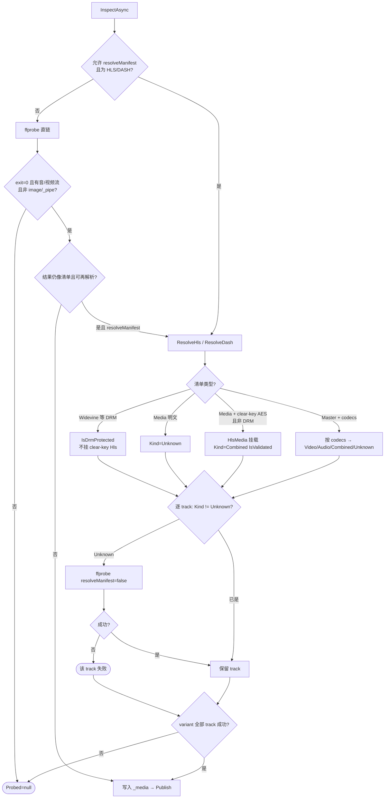
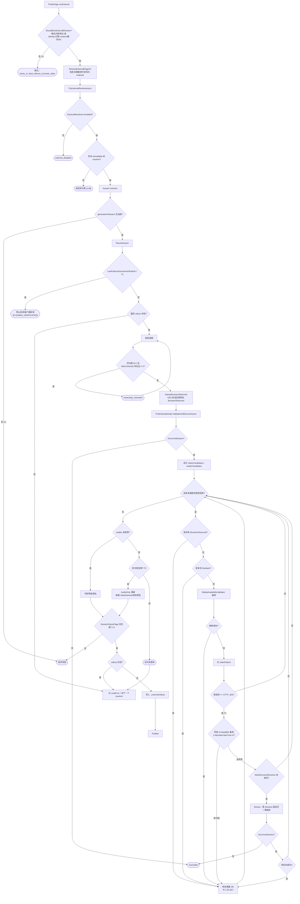
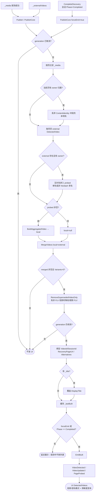
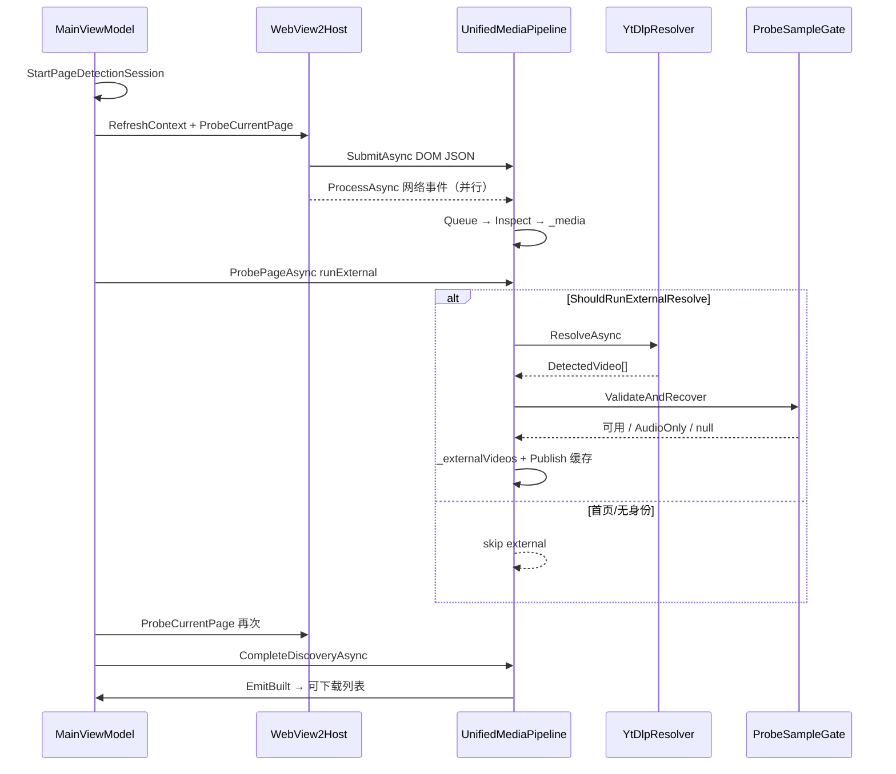

# 探测流程详解（至可下载音视频列表）

**日期：** 2026-09-08  
**范围：** 从会话触发到 UI 展示可下载视频/音频变体列表  
**主路径：** `MainViewModel` → `WebView2Host` → `UnifiedMediaPipeline`（+ `YtDlpResolver` / `ProbeSampleGate`）

本文包含总览图与三张拆解图，**每个菱形均为代码中的真实分支判断**。

---

## 0. 总览



| 阶段 | 关键类型 | 主要文件 |
|------|----------|----------|
| 会话 | `MainViewModel.StartPageDetectionSession` | `MainViewModel.cs` |
| 一轮探测 | `RunPagePassAsync` | `MainViewModel.cs` |
| DOM | `WebView2Host.ProbeCurrentPageAsync` | `WebView2Host.cs` |
| 网络 | CDP → `ProcessAsync` | `WebView2Host.cs` / `UnifiedMediaPipeline.cs` |
| 入队校验 | `Queue` / `InspectAsync` | `UnifiedMediaPipeline.cs` |
| 外置 | `TryExternalResolveAsync` + `ProbeSampleGate` | 同上 + `YtDlpResolver.cs` |
| 展示 | `PublishCore` / `CompleteDiscoveryAsync` | `UnifiedMediaPipeline.cs` |

---

## 1. 会话与 PagePass（入口分支）



### 分支说明

| 判断 | 真 | 假 |
|------|----|----|
| 同 `pageKey` 防抖 | 忽略本次启动 | 开新世代 |
| `clearUi` | 清空已发现列表 | 只清管线、保留 UI 直至更强结果 |
| Tab 未初始化 | 空上下文继续 | 刷新 Cookie/头 + DOM |
| DOM 失败 | 告警 | 正常捕获上下文 |
| `runExternal` | 跑 yt-dlp + 二次 DOM | 仅依赖已 Submit 的 DOM/网络 |
| `CompleteDiscovery` | 等会话空闲后 `Phase=Completed` 并 `forceEmit` | — |

---

## 2. 网络入队拆解（CDP → Queue → Inspect）

```mermaid
flowchart TD
  subgraph CDP[WebView2Host CDP]
    N0[Network.responseReceived<br/>/ loadingFinished] --> N1{粗筛像媒体?<br/>IsCandidate 或归属页}
    N1 -->|否| N1N([不入队])
    N1 -->|是| N2[EnqueueRawEvent]
    N2 --> N3[归一化为 NormalizedNetworkEvent]
    N3 --> PC[ProcessAsync / ProcessCoreAsync]
  end

  subgraph BODY[响应体扫地址]
    B0[可取 body 的文本响应] --> B1[扫出 URL]
    B1 --> B2{candidates 数量 > 0?}
    B2 -->|否| B2N([仅打日志])
    B2 -->|是| B3[SubmitAsync JSON candidates]
    B3 --> PP
  end

  subgraph DOM2[DOM]
    D0[脚本: identity/caption/media/candidates<br/>+ ADDRESS_DISCOVERY] --> D1[SubmitAsync / ProbePage JSON]
    D1 --> PP[ProbePageCoreAsync]
  end

  PC --> C1{会话 TryEnter 成功?}
  C1 -->|否| CX([丢弃])
  C1 -->|是| C2{SessionId 空或匹配当前?}
  C2 -->|否| CX
  C2 -->|是| C3{StatusCode 为 200/206/null?}
  C3 -->|否| CX
  C3 -->|是| C4{PageUrl 或 _page 存在?}
  C4 -->|否| CX
  C4 -->|是| C5{_page 已绑定且<br/>e.PageUrl 不同页?}
  C5 -->|是 跨页迟到| CX
  C5 -->|否| C6{URL 含 sabr=1 且<br/>无 mime=video/audio?}
  C6 -->|是| CX
  C6 -->|否| C6b{IsBrowserPlayEvidence?<br/>200/206 + Media 或强 MIME}
  C6b -->|是| C6c[登记 _browserObserved<br/>BrowserObserved=true]
  C6b -->|否| C7
  C6c --> C7{IsLikelySegment?<br/>且非 browserPlay}
  C7 -->|是| CX
  C7 -->|否| C8{IsCandidate?<br/>或 browserPlay}
  C8 -->|否| CX
  C8 -->|是| Q0[Queue]
  note1[ResourceType=Media 一律 IsCandidate=true<br/>忽略 Range 小 Content-Length]

  PP --> K1{TryEnter 成功?}
  K1 -->|否| KX([返回])
  K1 -->|是| K2{IsDirectMediaPage?}
  K2 -->|是| Q0
  K2 -->|否| K3{有 pageScriptJson?}
  K3 -->|否| K9
  K3 -->|是| K4{JSON 可解析?}
  K4 -->|否| K9
  K4 -->|是| K5[写 identity / caption / author]
  K5 --> K6{media[] 项}
  K6 -->|非 URI / 分片 / JunkPath| K6N([跳过项])
  K6 -->|通过| Q0
  K5 --> K7{candidates[] 项}
  K7 -->|无绝对 url| K7N([跳过])
  K7 -->|contentIdentity 与当前归属冲突| K7R([跳过：归属不匹配])
  K7 -->|通过| Q0
  K6N --> K9
  K7N --> K9
  K7R --> K9
  K9[Publish 非强制] --> K10{runExternal?}
  K10 -->|否| KX
  K10 -->|是| EXT_GATE{见第 3 节}

  Q0 --> Q1{scheme http/https?}
  Q1 -->|否| QX([丢弃])
  Q1 -->|是| Q2{非强 MIME 且过小<br/>且非 m3u8/mpd<br/>且非 range/videoplayback?}
  Q2 -->|是| QX
  Q2 -->|否| Q3{continuation lease?}
  Q3 -->|否| QX
  Q3 -->|是| Q4{去重键已存在?<br/>primary: 或 network: + Normalize}
  Q4 -->|是| QX
  Q4 -->|否| Q5[占 ffprobe 槽 / 90s budget]
  Q5 --> Q6{BrowserObserved?}
  Q6 -->|是| Q6A[FromBrowserObservation<br/>跳过 ffprobe/再 GET]
  Q6 -->|否| INS[InspectAsync]
  Q6A --> PUB[Publish]
  INS --> PUB
```
### `IsCandidate` 子分支



> **TikTok 优先策略（2026-09-08）：** CDP 实播（`BrowserObserved`）> DOM/playAddr > yt-dlp > 独立 `MediaAvailabilityValidator`。浏览器已成功 200/206 的 Media 不再被二次抽样否决。
### `InspectAsync` 子分支



| 判断 | 代码位置 |
|------|----------|
| ProcessCore 过滤链 | `UnifiedMediaPipeline.ProcessCoreAsync` |
| IsCandidate | `UnifiedMediaPipeline.IsCandidate` |
| Queue 去重/过小 | `UnifiedMediaPipeline.Queue` |
| HLS AES | `HlsManifestParser.TryParseClearKeyMedia` |
| Inspect 清单 | `InspectManifestAsync` |

---

## 3. 外置解析拆解（yt-dlp → ProbeSampleGate）



### 外置相关常量与语义

| 项 | 值 / 含义 |
|----|-----------|
| `MaxAlternateTries` | 4（同批备用） |
| `MaxRecoveryResolves` | 1（重新解析次数） |
| Y1 | 人机验证：停客户端轮询，明确错误码 |
| Y3 | 首页/信息流无具体身份：不调 yt-dlp |
| T1 | 视频 403：备用 → renew |
| T2 | 仅音频：部分成功，不清视频失败原因 |
| C1 | 恢复/校验结果不得写回已切换的新页 |

---

## 4. Publish / 列表展示拆解



### UI 侧消费

| 事件 | `MainViewModel` 行为 |
|------|----------------------|
| `VideoDetected` | 插入/替换卡片；`_forceReplaceResults` 时清旧 |
| 手动探测结束且 Count=0 | 展示 `LastValidationError` 或 `LastExternalError` |
| 自动轮结束且 Count=0 | `status.probeEmpty` / 带外置提示 |

---

## 5. 端到端时序（简）



---

## 6. 相关源码索引

| 符号 | 路径 |
|------|------|
| `StartPageDetectionSession` / `RunPagePassAsync` | `src/VideoDownloader.UI/ViewModels/MainViewModel.cs` |
| `ProbeCurrentPageAsync` / CDP | `src/VideoDownloader.Infrastructure/Browser/WebView2Host.cs` |
| `ProcessCoreAsync` / `Queue` / `Inspect*` / `PublishCore` | `src/VideoDownloader.Infrastructure/Detection/UnifiedMediaPipeline.cs` |
| `ShouldRunExternalResolve` | 同上 |
| `ProbeSampleGate` | `src/VideoDownloader.Infrastructure/Detection/ProbeSampleGate.cs` |
| `YtDlpResolver` | `src/VideoDownloader.Infrastructure/Sites/ExternalResolvers/YtDlpResolver.cs` |
| `HlsManifestParser` / clear-key | `src/VideoDownloader.Core/Manifests/HlsManifestParser.cs` |
| `DetectionSession` 相位 | `src/VideoDownloader.Core/Detection/DetectionSession.cs` |

---

## 7. 修订记录

| 日期 | 说明 |
|------|------|
| 2026-09-08 | 初版：总览 + 网络入队 / 外置 / Publish 三拆解，对齐 AES clear-key、Y1–C1、延迟 Emit |
